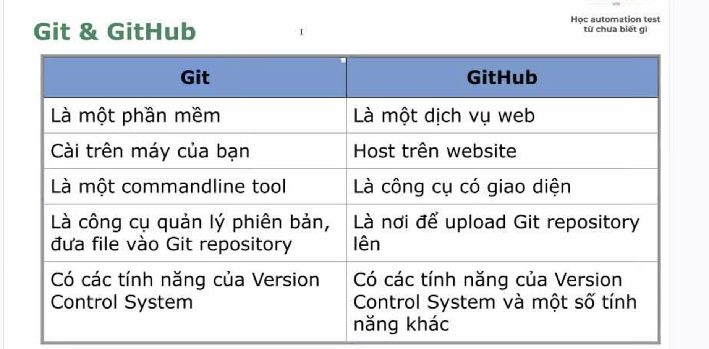
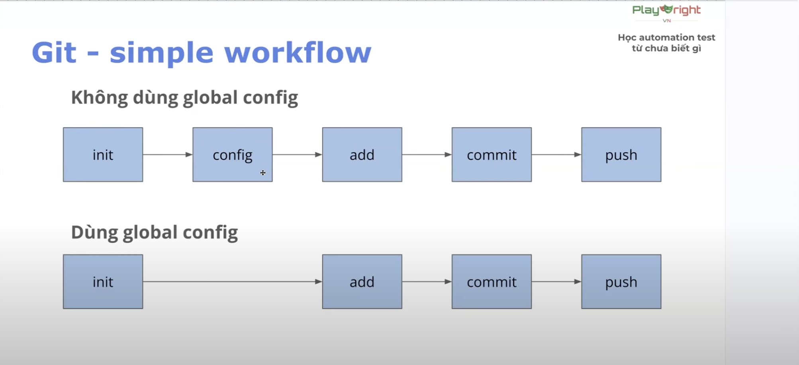
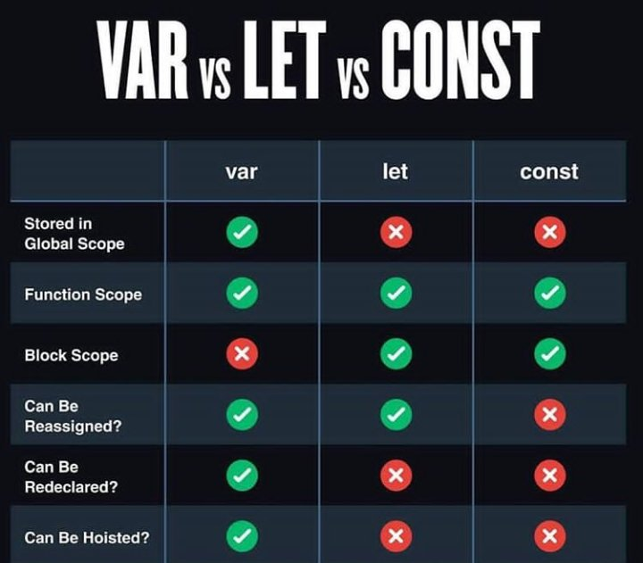

# **DAY 2**

## Version Control System

- Viết tắt: VCS, hệ thống quản lí các phiên bản.

*Các kiểu VCS*
1. **Local**: Lưu máy cá nhân
2. **Centralize**: lưu ở một máy chủ tập trung
3. **Distributed**: lưu ở nhiều máy khác nhau

## Git

- Mục đích: quản lí phiên bản và làm việc giữa nhiều người với nhau.

*Điểm mạnh của Git với các VCS khác*
- Tính năng dễ dùng, branching, tốc độ xử lí nhanh.
- Chi phí - free.
- Phổ biến, đang có rất nhiều công ty sử dụng.

**Three states**
1. Working directory (Local) - Các file mới hoặc file có thay đổi.
2. Staging Area - Vùng chuẩn bị commit, nơi tạo ra các phiên bản.
3. Repository - nơi các commit/phiên bản được lưu trữ.

**Git commands flow**
- *Git init* - khởi tạo thư mục được Git quản lí và đưa data đang có vào vùng **Working Directory**.
- *Git config* - sử dụng để cấu hình Git. 
- *Git status* - xem trạng thái file / data.
- *Git add* - đưa data vào vùng **Staging Area**. Sử dụng git add . => đưa tất cả các thay đổi lên.
- *Git commit* - đưa data vào vùng **Repository**, dân gian còn gọi là push code. Thường phải có message đi kèo với cú pháp -m "[message cần note]"
- *Git log* - kiểm tra lịch sử commit.

*Commit convention*
- Những quy tắc cần tuân thủ khi commit 
- Giúp cả team làm việc dễ dàng và code sạch đẹp, gọn gàng hơn.

## Javaccript Basic

### Variables

- Biến, dùng để lưu trữ các giá trị. Cú pháp khai báo: <type> <name> = <value>;
- Các kiểu Biến: var, let và const.

- Thường sẽ sử dụng **let** và **const**, KHÔNG dùng **var**.

### Data Types

*Có 8 loại kiểu dữ liệu*
1. String
2. Number
3. BigInt
4. Boolean
5. Unverified
6. Null
7. Symbol
8. Object

### Toán tử So Sánh

- Sử dụng để so sánh giá trị giữa 2 biến với nhau. Giá trị trả về = **Boolean**.
- Toán tử so sánh hơn kém: **< , >**.
- Toán tử so sánh bằng: **== , === , != , !== , >= , <=**.

### Toán tử 1 ngôi

- Dùng để tăng hoặc giảm giá trị.
- **i++ == i=i+1**
- **i-- == i=i-1**

### Điều kiện

- Dùng để kiểm tra có nên thực hiện 1 đoạn logic hay không.
- Cú pháp: **if ([điều kiện]) {[thực thi đoạn code]}**;

### Vòng lặp

- Dùng để thực hiện đoạn logic với số lần nhất định
- Cú pháp: **for (<Khởi tạo>;<Điều kiện dừng>;<Điều kiện tăng>) {[thực thi đoạn code]}**

***Format Code***

- Mac: *Option + Shift + F*
- Window: *Alt + Shift + F*

