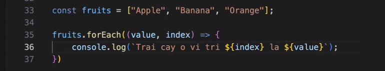

# ***DAY 4 07/12/2024***

## **JAVASCRIPT**

**Phạm vi của biến, var và let**

- Phạm vi của biến 
    - Global : var
    - Scope: {} : let

**Điều Kiện Nâng Cao**
- if ... else
- if ... else if 
- switch .... case
- default

**== và !=**
- So sánh giá trị thôi
- === và !== so sánh tuyệt đối
- Nếu check số thì nên check ===, check string thì chỉ cần ==

**Vòng lặp nâng cao**
- for ... in 
    - Sử dụng để lặp các thuộc tính trong object
    - Cho phép truy cập đến các index trong array

- forEach
     

- For ... of

**Break và Continue**

